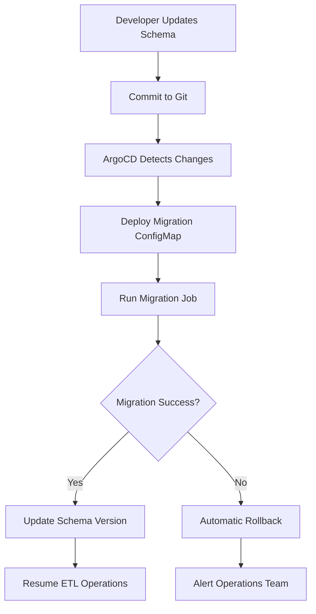

# JIRA-GitHub Integration for Strategy-to-Implementation Traceability

This directory contains company-specific implementation for integrating JIRA strategic planning with GitHub implementation tracking using Neo4j graph database.

## Overview

The system provides:
- **Bidirectional Traceability**: From business strategy (JIRA) to implementation (GitHub)
- **Hierarchical Filtering**: Only includes closed items with open dependencies
- **Cross-Reference Detection**: Automatically links JIRA references in GitHub issues
- **Technology Tracking**: Monitors adoption patterns across both systems
- **Gap Analysis**: Identifies strategic items without implementation

## Architecture

```
┌─────────────────┐    ┌─────────────────┐    ┌─────────────────┐
│   JIRA          │    │   GitHub        │    │   Neo4j         │
│   (Strategy)    │───▶│   (Implementation)│───▶│   (Graph DB)    │
│                 │    │                 │    │                 │
│ • AAPRFE        │    │ • ansible/ansible│    │ • Relationships │
│ • ANSTRAT       │    │ • ansible/awx   │    │ • Analytics     │
│                 │    │ • Collections   │    │ • Queries       │
└─────────────────┘    └─────────────────┘    └─────────────────┘
```

## Data Model

### Core Node Types
- **JiraIssue**: Strategic planning items (AAPRFE, ANSTRAT)
- **GitHubIssue**: Implementation items (issues, PRs)
- **Technology**: Technologies mentioned across systems
- **Component**: System components (controller, core, collections)
- **Person**: Contributors across both systems

### Key Relationships
- `IMPLEMENTED_BY`: JIRA → GitHub implementation
- `ADDRESSES`: GitHub → JIRA strategic item
- `INVOLVES`: Items → Technologies
- `AFFECTS`: Items → Components

## Directory Structure

```
company-specific/
├── schema/
│   └── jira-github-integration-schema.cypher    # Neo4j schema definition
├── etl/
│   ├── jira-github-integration/
│   │   ├── jira_github_etl.py                   # Main ETL implementation
│   │   ├── config.yaml                          # ETL configuration
│   │   ├── requirements.txt                     # Python dependencies
│   │   ├── Dockerfile                           # Container definition
│   │   └── cronjob.yaml                         # Kubernetes CronJobs
│   └── shared/
│       └── configmap.yaml                       # Kubernetes ConfigMap
├── applications/
│   └── jira-github-integration-stack.yaml       # ArgoCD application
└── README.md                                    # This file
```

## Setup Instructions

### 1. Prerequisites
- Kubernetes cluster with ArgoCD
- Neo4j database (existing graphserver setup)
- JIRA API access (username + token)
- GitHub API access (personal access token)

### 2. Configure Secrets
Update the secrets in `applications/jira-github-integration-stack.yaml`:

```yaml
# Note: Secrets are now managed through OpenShift secrets (see main README Step 6)
  # The following values should be created as secrets instead of hardcoded:
  stringData:
  jira-server: "https://your-jira-instance.atlassian.net"
  jira-username: "your-jira-username"
  jira-token: "your-jira-api-token"
  github-token: "your-github-personal-access-token"
```

### 3. Deploy Schema
Apply the Neo4j schema:

```bash
# Connect to Neo4j and run:
cat company-specific/schema/jira-github-integration-schema.cypher | cypher-shell
```

### 4. Deploy ETL Stack
```bash
# Apply the ArgoCD application
kubectl apply -f company-specific/applications/jira-github-integration-stack.yaml
```

### 5. Build and Push Container
```bash
cd company-specific/etl/jira-github-integration
docker build -t jira-github-integration-etl:latest .
docker push your-registry/jira-github-integration-etl:latest
```

## Configuration

### Data Sources
- **JIRA Projects**: AAPRFE (RFEs), ANSTRAT (Strategy)
- **GitHub Repositories**: Complete Ansible ecosystem (25+ repositories)
  - Core Execution & Orchestration: ansible/ansible, ansible-compat, ansible-runner, receptor, ansible-builder
  - Execution Environments: execution-environment, galaxy-importer, ansible-navigator
  - Controller & Networking: awx, receptor, django/channels
  - Collections & Content: ansible-collections, galaxy-ng, automation-hub-ui
  - CI/CD & Testing: molecule, ansible-lint, tox-ansible, test-infra, ara
  - Developer Tools: ansible-navigator, ansible-dev-tools, collections-metadata
  - Event-Driven & Other: event-driven-ansible, ansible.eda, insights-core
- **Filtering**: Only open items + closed items with open dependencies

### Scheduling
- **Full Sync**: Daily at 2 AM UTC
- **Incremental**: Every 4 hours
- **Cleanup**: Weekly on Sunday at 1 AM UTC

### Rate Limiting
- **JIRA**: 1 second delay between requests
- **GitHub**: 0.5 second delay between requests
- **Batch Sizes**: JIRA (50), GitHub (100)

## Key Features

### 1. Hierarchical Filtering
Only includes closed items that:
- Are referenced by open items
- Have open dependencies
- Are part of active strategic initiatives

### 2. Cross-Reference Detection
Automatically detects JIRA references in GitHub:
- Direct references: `AAPRFE-1234`, `ANSTRAT-5678`
- Contextual references: "fixes AAPRFE-1234", "implements ANSTRAT-5678"

### 3. Technology Extraction
Identifies technology mentions:
- Infrastructure: Redis, Vault, HashiCorp, Terraform
- Platforms: Kubernetes, OpenShift
- Capabilities: AI/ML, EDA, Automation Mesh

### 4. Component Mapping
Maps items to system components:
- **Controller**: AWX, Ansible Controller
- **Core**: Ansible, Ansible Core
- **Collections**: Galaxy, Automation Hub
- **Networking**: Receptor, Automation Mesh
- **CI/CD**: Molecule, Ansible Lint

## Analytics Queries

### Validation Queries
```cypher
// Cross-reference coverage
MATCH (j:JiraIssue)
WHERE j.project IN ['AAPRFE', 'ANSTRAT'] AND j.status IN ['Open', 'In Progress', 'New']
OPTIONAL MATCH (j)-[:TRACKED_IN]->(g:GitHubIssue)
RETURN j.project as project, 
       count(j) as total_strategic_items,
       count(g) as items_with_github_tracking,
       round(count(g) * 100.0 / count(j), 2) as tracking_percentage;
```

### Gap Analysis
```cypher
// Orphaned strategic items (no GitHub tracking)
MATCH (j:JiraIssue)
WHERE j.project IN ['AAPRFE', 'ANSTRAT'] 
  AND j.status IN ['Open', 'In Progress', 'New']
  AND NOT (j)-[:TRACKED_IN]->(:GitHubIssue)
RETURN j.key, j.summary, j.status, j.priority, j.components
ORDER BY j.priority DESC, j.updated DESC;
```

### Technology Adoption
```cypher
// Technology adoption analysis
MATCH (t:Technology)<-[:INVOLVES]-(j:JiraIssue)
WHERE j.status IN ['Open', 'In Progress', 'New']
WITH t, count(j) as strategic_mentions
OPTIONAL MATCH (t)<-[:INVOLVES]-(g:GitHubIssue)
WHERE g.state = 'open'
RETURN t.name as technology,
       strategic_mentions,
       count(g) as implementation_mentions,
       round(count(g) * 100.0 / strategic_mentions, 2) as implementation_ratio
ORDER BY strategic_mentions DESC;
```

### Repository Ecosystem Analysis
```cypher
// Analyze the complete Ansible ecosystem
RETURN custom.analyzeRepositoryEcosystem() as ecosystem;

// Results show activity levels across all 25+ repositories:
// - Core: ansible/ansible, ansible-compat, ansible-runner
// - Controller: awx, channels
// - Collections: galaxy-ng, automation-hub-ui, ansible-collections
// - Execution Environments: ansible-builder, execution-environment, ansible-navigator
// - CI/CD: molecule, ansible-lint, test-infra, tox-ansible, ara
// - Developer Tools: ansible-dev-tools, collections-metadata
// - Event-Driven: event-driven-ansible, ansible.eda
// - Insights: insights-core
```

### Cross-Ecosystem Impact Analysis
```cypher
// Analyze how strategic items impact different repository categories
RETURN custom.analyzeCrossEcosystemImpact() as impact;

// Shows:
// - Which JIRA components affect which GitHub repository categories
// - Breadth of ecosystem impact per strategic initiative
// - Implementation distribution across repository types
```

### Advanced Analytics Functions
The schema includes custom functions for comprehensive analysis:

- **`custom.findOrphanedStrategicItems()`**: Strategic items without GitHub implementation
- **`custom.findImplementationGapsByComponent()`**: Gap analysis by component
- **`custom.trackTechnologyAdoption()`**: Technology adoption patterns
- **`custom.analyzeRepositoryEcosystem()`**: Complete ecosystem health analysis
- **`custom.analyzeCrossEcosystemImpact()`**: Cross-repository impact assessment

## Monitoring

### Health Checks
- Data freshness (last sync timestamps)
- Data quality (missing required fields)
- Relationship integrity (bidirectional links)

### Metrics
- Items processed per sync
- Cross-references detected
- Processing time and error rates

### Alerts
- Sync failures
- Data quality issues
- Processing time exceeding thresholds

## Data Retention

### Retention Policies
- **Closed Items**: 90 days (unless referenced by open items)
- **Orphaned Items**: 30 days
- **Stale Data**: Cleaned weekly

### Cleanup Process
- Removes items closed > 90 days without open dependencies
- Preserves items referenced by active work
- Maintains referential integrity

## Security

### Access Control
- Service account with minimal RBAC permissions
- Secrets stored in Kubernetes secrets
- Non-root container execution

### Data Protection
- API tokens stored as secrets
- No sensitive data in logs
- Secure connections to all services

## Troubleshooting

### Common Issues

1. **JIRA Connection Failures**
   - Verify JIRA server URL and credentials
   - Check API token permissions
   - Review rate limiting settings

2. **GitHub Rate Limiting**
   - Verify GitHub token permissions
   - Adjust rate limiting delays
   - Check GitHub API quotas

3. **Neo4j Connection Issues**
   - Verify Neo4j credentials and URI
   - Check APOC plugin availability
   - Review database permissions

### Debugging
```bash
# Check ETL logs
kubectl logs -n graphserver -l app=jira-github-integration-etl

# Run manual sync
kubectl create job --from=cronjob/jira-github-integration-etl manual-sync-$(date +%s)

# Validate data in Neo4j
cypher-shell < company-specific/applications/jira-github-integration-stack.yaml
```

## Schema Management & Migrations

### ArgoCD-Managed Schema Updates

When schema updates are needed after deployment with existing data, the system uses a GitOps-based migration approach:

#### 1. **Migration Process**
```bash
# Update schema version in ConfigMap
echo "2.1" > company-specific/etl/jira-github-integration/schema-migration.yaml

# Add new migration script
cat > migrations/004-new-feature.cypher << EOF
// Migration 004: Add new feature
CREATE INDEX new_feature_index IF NOT EXISTS FOR (n:NewNode) ON (n.property);
EOF

# Commit and push changes
git add . && git commit -m "Schema migration v2.1: Add new feature"
git push origin main
```

#### 2. **ArgoCD Sync Waves**
The migration system uses ArgoCD sync waves for proper ordering:
- **Wave 0**: Migration ConfigMap (contains migration scripts)
- **Wave 1**: Migration Job (applies schema changes)
- **Wave 2**: Health checks and schema validation
- **Wave 3**: ETL jobs (resume normal operation)

#### 3. **Automatic Backup & Rollback**
- **Pre-Migration Backup**: Automatic data export before changes
- **Failure Detection**: Migration job monitors for errors
- **Automatic Rollback**: Restores from backup if migration fails
- **Manual Rollback**: Documented process for manual intervention

#### 4. **Migration Safety Features**
- **Idempotent Scripts**: All migrations can be run multiple times safely
- **Version Tracking**: Schema versions stored in database
- **Data Validation**: Post-migration integrity checks
- **Zero-Downtime**: ETL processes pause during migration

### Schema Migration Workflow



### Migration Commands

```bash
# Check current schema version
kubectl exec -it deployment/neo4j -n graphserver -- \
  cypher-shell -u neo4j -p PASSWORD \
  "MATCH (v:SchemaVersion) RETURN v.version ORDER BY v.applied DESC LIMIT 1;"

# Manually trigger migration
kubectl create job --from=job/schema-migration-job manual-migration-$(date +%s) -n graphserver

# Monitor migration progress
kubectl logs job/schema-migration-job -n graphserver -f

# Check migration status
kubectl get jobs -n graphserver -l app=schema-migration
```

### Rollback Procedures

#### Automatic Rollback
- Triggered on migration failure
- Uses APOC export/import for data restoration
- Preserves data integrity

#### Manual Rollback
```bash
# Stop ETL processes
kubectl scale cronjob jira-github-integration-etl --replicas=0 -n graphserver

# Connect to Neo4j
kubectl port-forward svc/neo4j 7687:7687 -n graphserver

# Restore from backup (in Neo4j)
MATCH (n) DETACH DELETE n;
CALL apoc.cypher.runFile('/tmp/backup-pre-migration.cypher');

# Restart ETL
kubectl scale cronjob jira-github-integration-etl --replicas=1 -n graphserver
```

## Future Enhancements

### Planned Features
- Real-time webhook integration
- Advanced ML-based relationship detection
- Custom dashboard for strategic planning
- Integration with additional tools (Confluence, Slack)
- Blue-green schema deployments
- Automated migration testing

### Scalability Considerations
- Horizontal scaling for large repositories
- Incremental processing optimizations
- Caching for frequently accessed data
- Archive strategy for historical data
- Schema versioning and compatibility
- Migration performance optimization

## Support

For issues and questions:
1. Check the troubleshooting section
2. Review logs and metrics
3. Validate configuration settings
4. Contact the platform team

---

**Note**: This implementation is company-specific and contains sensitive configuration. Ensure proper access controls and data protection measures are in place.
